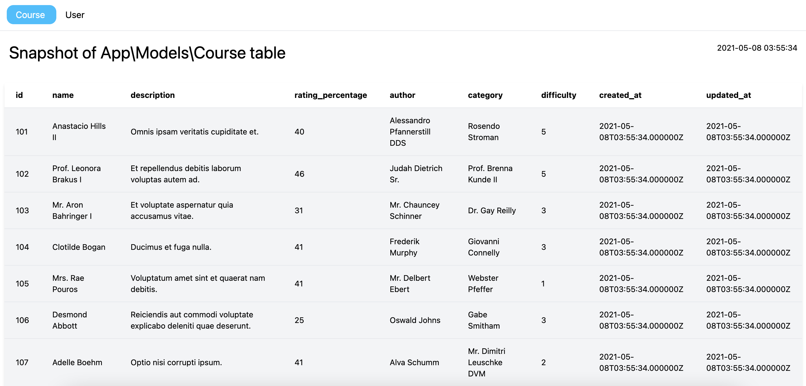
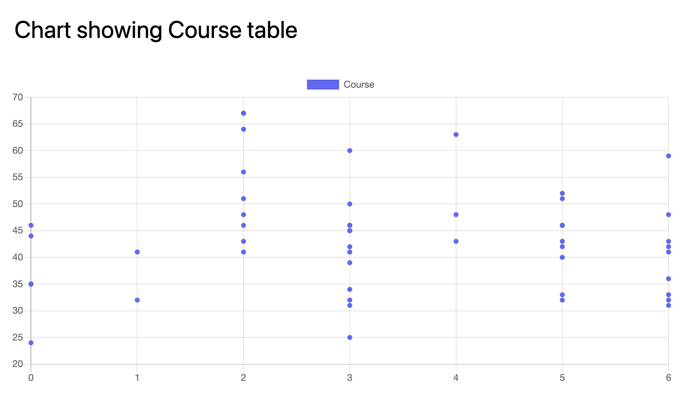

# snapshot

Laravel DB table snapshot package

## Installation

> composer require sebrave/snapshot

> composer update

> php artisan vendor:publish --provider="SebRave\\Snapshot\\SnapshotServiceProvider"

## Setup

Adjust settings in config/snapshot.php

## Usage

> app('snapshot')->show(MyClass::class);  

> app('snapshot')->show([MyClass::class, AnotherClass::class]);      

Where MyClass::class is an Eloquent model

> app('snapshot')->show('mytable');      

Where mytable is a table in your SQL database

A snapshot of the table is output in the root directory:

snapshot_myclass.html

Quick chart:

> app('snapshot')->draw('mytable', 'column_x_name', 'column_y_name');

## Example output

Here is an example of a database snapshot showing a 'courses' table:

Here is an example of a quick chart comparing two columns of the 'courses' table:

